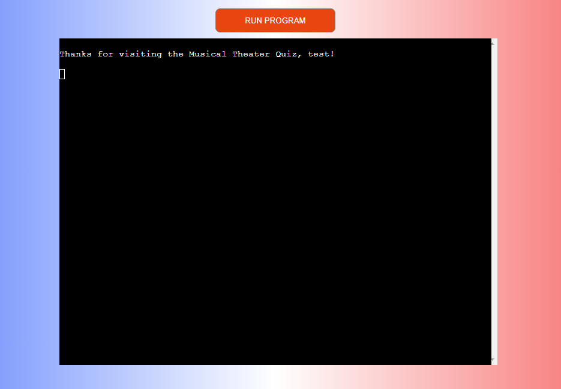

Musical Theatre Quiz is a simple multiple choice quiz that offers the user a fun and exciting way of testing their knowledge of the musical arts.
 
Get a question right? you get a point! Get a question wrong and it's all over!
How many points can you get? Find out in [Musical Theatre Quiz](https://musical-theater-quiz-c67f89732c69.herokuapp.com/).

# Contents
* [**User Experience**](<#user-experience>)
    * [User Stories](<#user-stories>)
    * [Wireframes](<#wireframes>)
    * [Flow Chart](<#flow-charts>)
    * [Design Choices](#design-choices)
        * [Typography](#typography)
        * [Colour Choices](#colour-choices)
* [**The Quiz**](<#the-quiz>)
    * [Main Page](<#main-page>)
        * [The Quiz](<#play-the-quiz>)
        * [Instructions](<#instructions>)
        * [Leaderboard](<#leaderboard>)
        * [Exit the game](<#exit-game>)
    * [Future Features](<#future-features>)
* [**Testing**](<#testing>)
    * [Python Linter Testing](<#code-institute-python-linter>)
    * [User Stories](<#user-stories>)
    * [Debugging](<#debugging>)
        * [Bugs Remaining](<#bugs-remaining>)
        * [Fixed bugs](<#fixed-bugs>)
    * [Deployment](<#deployment>)
        * [Heroku](<#heroku>)
        * [Fork](<#to-fork-the-project>)
        * [Clone](<#to-clone-the-project>)
* [**Credits**](<#credits>)
    * [Technologies used](<#technologies-used>)
    * [Acknowledgements](<#acknowledgments>)

# User Experience #

## User Stories ##
- As a user I would like an easy interface with clear instruction.
- As a user I would like the quiz to be difficult but fun.
- As a user I would like to be able to see the leaderboard.
- As a user I would like to know my score and see how many points I can get.

[Back to top](<#contents>)

## Wireframes ##
The initial wireframes were made on [Balsamiq](https://www.balsamiq.cloud). These wireframes of the quiz show a somewhat less thought out design but shows how much I've built upon to make sure the UX is stronger.
 

I wanted to make this a really easy interface with little distraction to ensure the user has the best experience.

[Back to top](<#contents>)

## Flow Charts ##
I made the flow chart using [Lucid Chart](https://www.lucidchart.com). This again shows a little more thought out process including different difficulties which would be offered in a future build. It also details how only 10 questions would be shown. I decided in terms of a competitive user experience, it's better to have one mode and compete for that top spot.

[Back to top](<#contents>)

## Design Choices ##

### Typography ###
Although technically not typography, the font art I used within my project was imported using [art](https://pypi.org/project/art/). I wanted the main screen to stand out and this can be seen by all headings within the quiz game.

[Back to top](<#contents>)

### Colour Choices ###
The colours I've chosen were inspired by the french flag. Mainly because when thinking of a standout group of colours for musical theatre, the french flag is such a prominent option due to the musical Les Miserables and it helps the screen pop out too. So I used the Linear gradient on [Gradient CSS](http://www.gradientcss.com/) to help me achieve this.

I also replicated this in the font colour choices for the most part of the quiz.

[Back to top](<#contents>)

# The Quiz #

## Main Page ##
The Quiz main screen is again inspired by the colours of the french flag (Les Miserables) and gives the user the option to enter their username, they can use characters and numbers.
 

If the user enters a username that is less than 3 or more than 10 characters long, they will receive the following message;

Once the user has put in the correct username character count, they are welcomed by the main menu;

The user is then given 4 options.
- 1) [Play the Quiz](<#play-the-quiz>)
- 2) [Instructions](<#instructions>)
- 3) [Leaderboard](<#leaderboard>)
- 4) [Exit Game](<#exit-game>)

[Back to top](<#contents>)

## Play the Quiz ##

When the user selects option one, they will be pushed into the quiz.

The user can then select 1,2,3 or 4 to choose their answer.

If the user gives an invalid option;

If they guess correctly;

A point is added onto their tally and they continue onto the next question.

If they guess incorrectly;

They are notified that they are incorrect, are supplied with the correct answer and then shown the game over screen;

<b>You only have <u>ONE</u> life in this quiz.</b>

This is so the comnpetitive nature of the quiz can really be shown.

[Back to top](<#contents>)

## Instructions ##

If the user selects number 2 as their option. They are greeted with the instructions for the quiz.

[Back to top](<#contents>)

## Leaderboard ##

If the user selects the leaderboard, then the leaderboard will show as follow;

The leaderboard is updated and fed to a google sheet which the programme automatically puts into descending order based on the score. Only the top 10 will be shown. If a player is lucky enough to get into the top 10, they will automatically be updated to the spreadsheet.

This is then automatically updated to reflect on the programme when the leaderboard is selected.

[Back to top](<#contents>)

## Exit Game ##

If the user selects to exit the game at any point they will be shown the following screen.

[Back to top](<#contents>)

## Future Features ##
- I'd like to incorporate an easy / hard mode
- expand on the questions and allow the users a higher point system.

[Back to top](<#contents>)

# Testing #

## Code Institute Python Linter ##

This threw up a few issues with indentation which I was unable to correct in time.

It also came back with a line that was too long. Something definitely to fix.

[Back to top](<#contents>)

## User Stories ##

- As a user I would like an easy interface with clear instruction.

<b><em>Every part of this quiz has been made to be clear. If it isn't, the instructions certainly help. </b></em>

- As a user I would like the quiz to be difficult but fun.

<b><em>As this is a multiple choice quiz AND practically a sudden death style quiz, you have the element of fun and danger wrapped up in a well thought out quiz.</b></em>

- As a user I would like to be able to see the leaderboard.

<b><em>This has been completed using the google sheets. Players will be able to view the leaderboard upon correct selection in the main menu.</b></em>

- As a user I would like to know my score and see how many points I can get.

<b><em>During the quiz the users are prompted each time they get a correct question and how many points they have received. They can also get the final score from the leaderboard (If they reach it).</b></em>

[Back to top](<#contents>)

## Debugging ##

### Bugs remaining ###
Aside from the small issues from the linter, there are no bugs remaining.

### Fixed bugs ###
- Issue when selecting an invalid option. FIXED
- Number of questions not working. FIXED
- Leaderboard was sending information but not retrieving - From the help of Ed at Code Institute, this was fixed.
- No remaining bugs.

[Back to top](<#contents>)

## Deployment ##

### Heroku ###

- Go on to [Heroku](https://www.heroku.com/) website and [log in](https://id.heroku.com/login) if you already have an account or [sign up](https://signup.heroku.com/) if you don't.
- Click on the "New" button on the top right of the home page and select "Create new App" from the drop-down menu.
- In the "App name" field enter the name of your app. This name has to be unique.
    - Heroku displays a green tick if your app name is available.
- In the "Choose a region" field choose either the United States or Europe based on your location.
- Click the "Create app" button.
- Next page, top centre of the screen, select the "Settings" tab.
- In the "Config Vars" section, click on the "Reveal config Vars" button.
- In this section you need to enter your google sheets credentials.
    1. Type the name of the credentials (CREDS in my case) file into the "KEY" field.
    2. Open your IDE and find CREDS.json in your project files.
    3. Copy/paste everything in this file to the "VALUE" field and click the "Add" button.
- Just below in the "Buildpacks" section click on the "Add buildback" button. Buildpacks have to be installed in this order.
    1. Click on the "Python" button to select it and then the "Save changes" button.
    2. Click again on the "Add buildback" button.
    3. Click on the "nodejs" button to select it and then the "Save changes" button.
- Go back to the top of the screen and select the "Deploy" tab.
- In the "Deployment method" section select "GitHub".
    1. In "Connect to GitHub" click on the "Search" button. Find the project repository in the list and click on the "Connect" button.
    2. Scroll to the bottom of that page. Click on the "Enable Automatic Deploys" button to update the deploy also when you push a new commit to GitHub.
    3. At the very bottom of the page click on the "Deploy Branch" button.
- You will see build log scrolling at the bottom of the screen after that. When successfully finished building the app, you should see the link to your app.

[Back to top](<#contents>)

## To fork the project ##

A copy of the repository can be made by forking the github account. This is the safest way to view and make changes as it won't have any effect on the original repository. The steps to fork the repository as as follows;

- Log into Github and find the [repository](https://github.com/pjrclarke/PP3-MTQuiz).
- On the right hand side of the screen, there is a button called 'Fork'. Select this for the repository onto this github account.

[Back to top](<#contents>)

## To clone the project ##

The method to clone this repository is as follows;

- Under the repository name, click on the clone tab.
- Once selected, click the copy to clipboard icon.

- In the IDE chosen to clone the project to, open gitbash.
- Change the working directory to the location you want the cloned directory to be made.
- Type "git clone" in the terminal and then paste the URL copied from github.
- Press Enter - The clone is now created.

[Back to top](<#contents>)

# Credits #

## Technologies used ##

* [HTML5](https://en.wikipedia.org/wiki/HTML5) - Provides the content for the website.
* [CSS](https://www.w3schools.com/css/css_intro.asp) - Provides the styling.
* [Python3](https://www.python.org/downloads/) - The main code used.
* [JavaScript](https://developer.mozilla.org/en-US/docs/Web/JavaScript) - Provides the scripting for the website.
* [Balsamiq](https://balsamiq.cloud/) - Used to create the wireframes.
* [CodeAnywhere](https://codeanywhere.com/) - Used to host and edit all code and the website.
* [Github](https://www.gitpod.io/#get-started) - Used to deploy the website.
* [art](https://pypi.org/project/art/) - Used for the font art.

[Back to top](<#contents>)

## Acknowledgments
The site was completed as a Portfolio Project 3 piece for the Full Stack Software Developer (e-Commerce) Diploma at the [Code Institute](https://codeinstitute.net/). As such I would like to thank my mentor [Precious Ijege](https://www.linkedin.com/in/precious-ijege-908a00168/), the Slack community, and all at the Code Institute for their help and support.

The ideas about how to handle the quiz within python was inspired by [realpython.com](https://lucid.app/documents#/documents?folder_id=recent). This really helped me understand the premise behind python code.

Thanks to the Love Sandwiches module. This was incredibly engaging and helpful.

Special mention to Ed at Code Institute. He really helped me when it came down to the leaderboard issues and helped me debug them.

Paul Clarke - 2023.

[Back to top](<#contents>)

