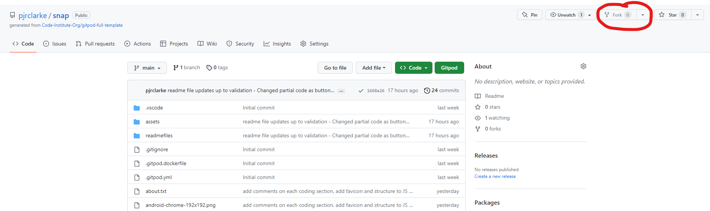

Introducing the Musical Theatre Quiz, an engaging and enjoyable multiple choice quiz that offers users an entertaining avenue to assess their expertise in the realm of musical arts.

In this captivating quiz, each correct answer rewards participants with valuable points, while an incorrect response brings an end to the thrilling challenge.

Curious to discover your potential? Embark on the Musical Theatre Quiz and put your knowledge to the test! 

Visit [Musical Theatre Quiz](https://musical-theater-quiz-c67f89732c69.herokuapp.com/) and unearth the depths of your musical theatre acumen.


# Contents
* [**User Experience**](<#user-experience>)
    * [User Stories](<#user-stories>)
    * [Wireframes](<#wireframes>)
    * [Flow Chart](<#flow-charts>)
    * [Design Choices](#design-choices)
        * [Typography](#typography)
        * [Colour Choices](#colour-choices)
* [**Features**](<#features>)
    * [Main Page](<#main-page>)
        * [The Quiz](<#play-the-quiz>)
        * [Instructions](<#instructions>)
        * [Leaderboard](<#leaderboard>)
        * [Exit the game](<#exit-game>)
    * [Future Features](<#future-features>)
* [**Testing**](<#testing>)
    * [Python Linter Testing](<#code-institute-python-linter>)
    * [lighthouse](<#lighthouse>)
    * [User Stories](<#user-stories>)
    * [Debugging](<#debugging>)
        * [Bugs Remaining](<#bugs-remaining>)
        * [Fixed bugs](<#fixed-bugs>)
* [**Deployment**](<#deployment>)
    * [Heroku](<#heroku>)
    * [Fork](<#to-fork-the-project>)
    * [Clone](<#to-clone-the-project>)
* [**Technologies used**](<#technologies-used>)
* [**Credits**](<#credits>)
    * [Acknowledgements](<#acknowledgments>)


# User Experience #


## User Stories ##
- As a user, I seek an interface characterised by its user-friendliness and the provision of lucid instructions, ensuring a seamless and intuitive user experience.
- As a user, I desire a quiz that strikes an optimal balance between challenge and enjoyment, offering intellectually stimulating questions and an engaging format.
- As a user, I aspire to access and peruse the leaderboard, enabling me to gauge my performance and compare my achievements with others, fostering a sense of competition and motivation.
- As a user, I appreciate the ability to effortlessly ascertain my score, thereby gaining insight into my performance and tracking the accumulation of points, enhancing my engagement and satisfaction within the quiz.

[Back to top](<#contents>)
<hr>

## Wireframes ##
The preliminary wireframes were crafted utilising the powerful wireframing tool [Balsamiq](https://www.balsamiq.cloud). Although these wireframes may exhibit a degree of initial simplicity, they serve as a testament to the iterative nature of the design process and the extent to which I have diligently enhanced the user experience (UX). Embracing an agile mindset in the development process is of paramount importance, particularly when the resulting output lends itself to continuous improvement and expansion. 
<br>
<details>
<summary><b>Balsamiq Wireframes</b></summary>


</details>

My primary objective was to establish an interface characterised by simplicity and minimal distractions, thereby fostering an optimal user experience.

[Back to top](<#contents>)
<hr>


## Flow Charts ##
I crafted the flow chart using the powerful tool [Miro](https://miro.com/), meticulously designing a clear and seamless linear path. User experience was paramount in my mind, and I dedicated significant effort to ensure a flawlessly smooth journey for every user.

<details>
<summary><b>Miro Flow Charts</b></summary>


</details>

[Back to top](<#contents>)
<hr>

## Design Choices ##


### Typography ###
While not strictly falling under the domain of typography, I incorporated font art into my project by leveraging the '[ART](https://pypi.org/project/art/)' library. A primary objective of mine was to create a visually distinctive main screen, evident through the prominent utilisation of font art in various headings throughout the quiz game.
<details>
<summary><b>Font Art Title Page</b></summary>


</details>

[Back to top](<#contents>)
<hr>


### Colour Choices ###
The color scheme I meticulously curated draws inspiration from the esteemed French flag. The selection of these colors was driven by their association with the realm of musical theatre, particularly the renowned production of Les Misérables. By employing a linear gradient generated through the utilisation of [Gradient CSS](http://www.gradientcss.com/) , I deftly achieved the desired effect of enhancing visual prominence and making the screen truly captivating.

<details>
<summary><b>Gradient CSS Colouring</b></summary>


</details>

Furthermore, I replicated this approach in the selection of font art colours employed throughout the majority of the quiz.

[Back to top](<#contents>)
<hr>

# Features #


## Main Page ##
The main screen of the Quiz is thoughtfully adorned with hues reminiscent of the French flag, drawing inspiration from the iconic musical "Les Misérables." Within this captivating interface, users are presented with the opportunity to input their username, which can encompass both alphanumeric characters and numerical values.

<details>
<summary><b>Main Page Imagery</b></summary>


</details>

In the event that the user enters a username containing fewer than three characters or exceeding the limit of ten characters, a corresponding message will be displayed, conveying the following information:

<details>
<summary><b>Username Character Count Error Imagery</b></summary>


</details>

If the user opts to input a username that includes special characters or numeric values, a message will be presented to inform them of the following:
<details>

<summary><b>Special / Numeric Character Error Imagery</b></summary>


</details>

Upon successfully providing a username that adheres to the specified character count and selection criteria, the user is cordially greeted by the main menu, which serves as their point of entry into the quiz experience.

<details>
<summary><b>Main Menu Imagery</b></summary>


</details>

The user is then given 4 options;

- 1) [Play the Quiz](<#play-the-quiz>)
- 2) [Instructions](<#instructions>)
- 3) [Leaderboard](<#leaderboard>)
- 4) [Exit Game](<#exit-game>)


[Back to top](<#contents>)
<hr>


## Play the Quiz ##
Upon selecting option one from the main menu, the user will seamlessly transition into the quiz section, where they can actively engage in answering the quiz questions.

<details>
<summary><b>Quiz Menu</b></summary>


</details>

The user is presented with the opportunity to select their answer by choosing a number from the available options, ranging from 1 to 4.

In the event that the user provides an invalid option, not corresponding to any of the available choices, an appropriate message will be displayed to notify the user of their invalid input.

<details>
<summary><b>Invalid Option</b></summary>


</details>

If the user makes a correct guess, the system acknowledges their response and provides positive feedback to indicate their accurate selection.

<details>
<summary><b>Correct Answer Imagery</b></summary>


</details>

Upon providing a correct answer, the system incrementally adds a point to their overall score, duly acknowledging their accurate response. The user seamlessly proceeds to the subsequent question, advancing through the quiz.


In the case of an incorrect guess, the user is promptly notified of their error and provided with the correct answer. Subsequently, the game concludes, and the user is presented with the game over screen.


<details>
<summary><b>Incorrect Answer & Game Over Imagery</b></summary>


</details>
<hr>
<br>
<b>You only have <u>ONE</u> life in this quiz.</b>

<br>

This design feature highlights the competitive nature of the quiz, showcasing the importance of accuracy and knowledge in the user's quest for success.
<br>


[Back to top](<#contents>)
<hr>


## Instructions ##


Upon selecting option 2, users are promptly presented with comprehensive instructions that serve as a guide for navigating through the quiz. This ensures that users are well-informed and equipped with the necessary information to proceed effectively.
<details>
<summary><b>Instructions Imagery</b></summary>


</details>

[Back to top](<#contents>)
<hr>


## Leaderboard ##


Upon selecting the leaderboard option, users will be presented with an organised and structured leaderboard display. This display showcases the rankings of participants, arranged in a clear and easily understandable format. Users can effortlessly observe and assess their relative position in relation to other participants, further enhancing the competitive aspect of the quiz experience.

<details>
<summary><b>Leaderboard Imagery</b></summary>


</details>

The leaderboard functionality incorporates an advanced integration with Google Sheets, enabling seamless data synchronization and real-time updates. The program dynamically populates the Google Sheet with the participants' scores, ensuring accurate tracking of their performance. The leaderboard is organised in descending order based on the scores achieved by the participants. 

As a testament to their exceptional performance, only the top 10 participants are showcased, symbolizing a distinguished level of achievement. 

<details>
<summary><b>Google Sheet Imagery</b></summary>


</details>

[Back to top](<#contents>)
<hr>


## Exit Game ##

In the event that the user opts to exit the game at any given point, a designated screen will be presented to provide a clear indication of their intent. This screen serves as a courteous farewell, acknowledging the user's decision to conclude their engagement with the game.

<details>
<summary><b>Exit Screen Imagery</b></summary>


</details>

[Back to top](<#contents>)
<hr>


## Future Features ##
- Implementation of an Easy/Hard mode: Introducing a user-selectable difficulty level will offer varying degrees of challenge, catering to different skill levels and preferences.

- Expansion of question pool: Enriching the quiz with an extensive range of questions will provide users with a more comprehensive and engaging experience. 

- Higher point system: Enhancing the scoring mechanism by incorporating a scaled point system will reward users for correctly answering more challenging questions. This adjustment will add depth and encourage users to strive for higher scores.

- Integration of a timer: Incorporating a timer within each question will introduce an element of time pressure, enhancing the sense of urgency and adding an additional layer of challenge to the quiz. Users will be prompted to answer questions within a specified timeframe, promoting quick thinking and decision-making skills.


[Back to top](<#contents>)
<hr>


# Testing #


## Code Institute Python Linter ##

Upon running my code through Code Institutes Python linter, it successfully returned a result with no detected errors. This outcome highlights the adherence of my code to the recommended Python coding standards and guidelines prescribed by Code Institute.

<details>
<summary><b>Code Institutes Python Linter Results</b></summary>


</details>

[Back to top](<#contents>)
<hr>

## Lighthouse ## 

As the website is currently live, I deemed it necessary to conduct Lighthouse testing to assess its performance. The results of the Lighthouse testing are as follows:

<details>
<summary><b>Lighthouse Results</b></summary>


</details>

[Back to top](<#contents>)
<hr>

## User Stories ##

- As a user, I seek an interface characterised by its user-friendliness and the provision of lucid instructions, ensuring a seamless and intuitive user experience.

<b><em>This quiz has been designed with utmost clarity in mind. If any part feels unclear, worry not, as the instructions are there to provide the necessary guidance.

Every aspect of the quiz has been carefully crafted to prioritize user understanding. The combination of user-friendly features and helpful instructions ensures a seamless and enjoyable experience. </b></em>

- As a user, I desire a quiz that strikes an optimal balance between challenge and enjoyment, offering intellectually stimulating questions and an engaging format.

<b><em>As this interactive assessment takes the form of a multiple-choice quiz with an element of jeopardy, participants are presented with an engaging blend of amusement and risk. This meticulously crafted quiz embodies a harmonious fusion of enjoyment and strategic thinking, ensuring an immersive experience for all participants.</b></em>

- As a user, I aspire to access and peruse the leaderboard, enabling me to gauge my performance and compare my achievements with others, fostering a sense of competition and motivation.

<b><em>The implementation of this feature leverages the capabilities of Google Sheets, enabling seamless integration with the game system. Upon successfully navigating the main menu and making accurate selections, players will be granted access to the leaderboard, where they can witness and appreciate the rankings of fellow participants.</b></em>

- As a user, I appreciate the ability to effortlessly ascertain my score, thereby gaining insight into my performance and tracking the accumulation of points, enhancing my engagement and satisfaction within the quiz.

<b><em>Throughout the quiz, participants will be promptly notified with congratulatory messages each time they provide a correct response, accompanied by the corresponding accumulation of points. Additionally, the option to retrieve the final score from the leaderboard will be available to users, provided they achieve a position worthy of inclusion.</b></em>

[Back to top](<#contents>)
<hr>

## Functionality ##

<b>All functionalities within the system operate as intended, without any deviations or unexpected behavior.</b>

[Back to top](<#contents>)
<hr>


## Debugging ##


### Bugs remaining ###

No bugs remaining. 


### Fixed bugs ###
- An issue arose when users selected an invalid option, resulting in the display of multiple error messages. However, this issue has been successfully addressed and resolved. 
- There was an issue with the system exceeding the maximum limit of 50 questions, which prevented the congratulatory message from being displayed. However, this issue has been identified and resolved. The system now correctly tracks the number of questions answered and displays the congratulatory message when the user reaches the maximum of 50 questions.
- The leaderboard functionality was encountering an issue where it was sending data but not retrieving it. With the assistance of Ed at Code Institute, this issue has been successfully resolved. The leaderboard now functions properly, allowing the retrieval of data as intended.
- The provided code snippet was designed to enforce the input of lowercase characters exclusively, treating uppercase characters as invalid input and raising an appropriate error.

```
while True:
            answer_label := input("\nWhat's your answer?\n").lower()
            if answer_label.lower() == "q":
                clear()
                main_menu_page()
            else:
                print(Fore.LIGHTRED_EX)
                print(f"Not a valid option")
                print(Fore.RESET)
                print(f"Please enter {','.join(labeled_alternatives)}",
                "or Q to quit to the main menu")
        answer = labeled_alternatives[answer_label]
        if answer == correct_answer:
            POINTS += 1
            print(Fore.LIGHTGREEN_EX + "\n Correct!\n" + Fore.RESET)
            print(f"Good Job, {USERNAME}!")
            print("You have "+Fore.GREEN+f"{POINTS}"+Fore.RESET+" points.")
            sleep(2)
            clear()
        elif answer != correct_answer and num_correct == 0:
            print(Fore.RED + "Incorrect!" + Fore.RESET) 
            print("The correct answer was",
            Fore.LIGHTGREEN_EX + f"{correct_answer}!" + Fore.RESET)
            sleep(3)
            clear()
            print(Fore.LIGHTRED_EX)
            tprint("{:>15}".format("GAME OVER\n\n"), font="rnd-medium\n")
            print(Fore.RESET)
            print(f"Good effort, {USERNAME}.\n")
            print(f"You got {POINTS} points.\n")
            print("Your score will be added to the leaderboard.\n")
            update_leaderboard()
            gameover()
        else:
            update_leaderboard()
            gameover()
```

Despite the initial attempt to enforce the exclusive use of lowercase characters, it was discovered that the implemented approach did not achieve the desired outcome. To address this, modifications were made by incorporating the lower() function within specific functions. As a result, the system now automatically converts user input to lowercase, ensuring consistent handling of uppercase and lowercase characters regardless of the user's input.

[Back to top](<#contents>)
<hr>


## Deployment ##


### Heroku ###


- Go on to [Heroku](https://www.heroku.com/) website and [log in](https://id.heroku.com/login) if you already have an account or [sign up](https://signup.heroku.com/) if you don't.
- Click on the "New" button on the top right of the home page and select "Create new App" from the drop-down menu.
- In the "App name" field enter the name of your app. This name has to be unique.
    - Heroku displays a green tick if your app name is available.
- In the "Choose a region" field choose either the United States or Europe based on your location.
- Click the "Create app" button.
- Next page, top centre of the screen, select the "Settings" tab.
- In the "Config Vars" section, click on the "Reveal config Vars" button.
- In this section you need to enter your google sheets credentials.
    1. Type the name of the credentials (CREDS in my case) file into the "KEY" field.
    2. Open your IDE and find CREDS.json in your project files.
    3. Copy/paste everything in this file to the "VALUE" field and click the "Add" button.
- Just below in the "Buildpacks" section click on the "Add buildback" button. Buildpacks have to be installed in this order.
    1. Click on the "Python" button to select it and then the "Save changes" button.
    2. Click again on the "Add buildback" button.
    3. Click on the "nodejs" button to select it and then the "Save changes" button.
- Go back to the top of the screen and select the "Deploy" tab.
- In the "Deployment method" section select "GitHub".
    1. In "Connect to GitHub" click on the "Search" button. Find the project repository in the list and click on the "Connect" button.
    2. Scroll to the bottom of that page. Click on the "Enable Automatic Deploys" button to update the deploy also when you push a new commit to GitHub.
    3. At the very bottom of the page click on the "Deploy Branch" button.
- You will see build log scrolling at the bottom of the screen after that. When successfully finished building the app, you should see the link to your app.


[Back to top](<#contents>)
<hr>


## To fork the project ##


A copy of the repository can be made by forking the github account. This is the safest way to view and make changes as it won't have any effect on the original repository. The steps to fork the repository as as follows;


- Log into Github and find the [repository](https://github.com/pjrclarke/PP3-MTQuiz).
- On the right hand side of the screen, there is a button called 'Fork'. Select this for the repository onto this github account.



[Back to top](<#contents>)
<hr>


## To clone the project ##


The method to clone this repository is as follows;


- Under the repository name, click on the clone tab.
- Once selected, click the copy to clipboard icon.


- In the IDE chosen to clone the project to, open gitbash.
- Change the working directory to the location you want the cloned directory to be made.
- Type "git clone" in the terminal and then paste the URL copied from github.
- Press Enter - The clone is now created.


[Back to top](<#contents>)
<hr>

# Technologies used #


* [HTML5](https://en.wikipedia.org/wiki/HTML5) - Provides the content for the website.
* [CSS](https://www.w3schools.com/css/css_intro.asp) - Provides the styling.
* [Python3](https://www.python.org/downloads/) - The main code used.
* [JavaScript](https://developer.mozilla.org/en-US/docs/Web/JavaScript) - Provides the scripting for the website.
* [Balsamiq](https://balsamiq.cloud/) - Used to create the wireframes.
* [CodeAnywhere](https://codeanywhere.com/) - Used to host and edit all code and the website.
* [Github](https://www.gitpod.io/#get-started) - Used to deploy the website.
* [art](https://pypi.org/project/art/) - Used for the font art.
* [Miro](https://miro.com/) - Used to create the flow chart.
* [ChatGPT](https://chat.openai.com/) - I utilised the tool as a means to effectively structure and organise my wording across the entirety of the readme file.

## Python Packages ## 


- art 5.9 - Font Art
- colorama 0.4.6 - Colouring certain fonts / words within the quiz
- tabulate 0.9.0 - Creation of tables for the leaderboard


[Back to top](<#contents>)
<hr>


# Credits #

## Acknowledgments
The site was completed as a Portfolio Project 3 piece for the Full Stack Software Developer (e-Commerce) Diploma at the [Code Institute](https://codeinstitute.net/). As such I would like to thank my mentor [Precious Ijege](https://www.linkedin.com/in/precious-ijege-908a00168/), the Slack community, and all at the Code Institute for their help and support.


The ideas about how to handle the quiz within python was inspired by [realpython.com](https://lucid.app/documents#/documents?folder_id=recent). This really helped me understand the premise behind python code.


Thanks to the Love Sandwiches module. This was incredibly engaging and helpful.


Special mention to Ed at Code Institute. He really helped me when it came down to the leaderboard issues and helped me debug them.


Paul Clarke - 2023.


[Back to top](<#contents>)
<hr>


